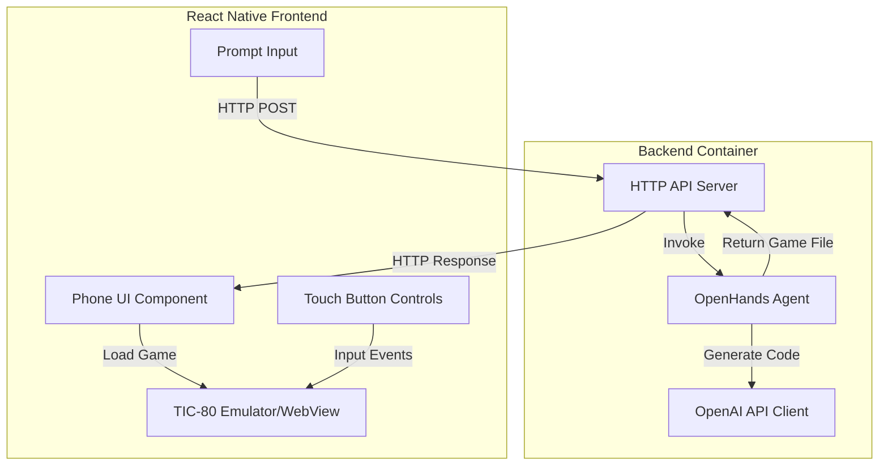

# Design Document

## Overview

The AI Game Generator system consists of three main components:

1. **React Native Frontend** - A mobile application displaying a Nokia-style phone interface with TIC-80 game emulation
2. **OpenHands Backend** - A containerized AI agent service that generates TIC-80 game code using OpenAI's API
3. **HTTP API Layer** - RESTful communication between frontend and backend for game generation requests

The system follows a request-response pattern where users submit natural language prompts through the frontend, which are processed by the backend to generate playable TIC-80 games that run within the phone interface.

## Architecture

### High-Level Architecture



### Component Interaction Flow

1. User enters game prompt in Frontend
2. Frontend sends HTTP POST request to Backend with prompt
3. Backend creates/reuses OpenHands session
4. Backend sends formatted prompt to OpenHands agent
5. OpenHands uses OpenAI Codex to generate TIC-80 Lua code
6. OpenHands saves code to file in workspace
7. Backend retrieves generated file content
8. Backend returns game code in HTTP response
9. Frontend loads game code into TIC-80 emulator
10. User plays game using touch controls

## Components and Interfaces

### Frontend Components

#### 1. Phone Canvas Component
- **Responsibility**: Render Nokia-style phone interface with screen and buttons
- **Technology**: React Native View components with custom styling
- **Key Features**:
  - Fixed aspect ratio phone frame
  - Game screen area (300x240px or similar TIC-80 resolution)
  - Left, right, answer-call, and standard numpad, in the style of a Nokia 3310. Of course, the numbers 2, 4, 6, 8 can be used as up, right, down and left buttons. We may communicate this in the prompt too.
  - Visual styling inspired by retro Nokia phones, but brand it as a "Wasa GenPhone"

#### 2. Game Runner Component (Existing)
- **Responsibility**: Embed and control TIC-80 emulator
- **Technology**: WebView (mobile) or iframe (web)
- **Key Features**:
  - Load TIC-80 player.html
  - Inject game code via postMessage
  - Expose simulateKey method for input injection
  - Handle platform differences (Android/iOS/Web)

#### 3. Prompt Input Component
- **Responsibility**: Capture user's game description
- **Technology**: React Native TextInput
- **Key Features**:
  - Multi-line text input
  - Character limit (optional, e.g., 500 chars)
  - Submit button with loading state
  - Error message display

#### 4. API Service Layer (Enhanced OpenHandsService)
- **Responsibility**: Communicate with backend HTTP API
- **Technology**: Fetch API
- **Key Methods**:
  - `generateGame(prompt: string): Promise<string>` - Single method to request game generation
  - Handle network errors and timeouts
  - Parse response containing game code

### Backend Components

#### 1. OpenHands HTTP API (Built-in)
- **Responsibility**: Expose REST endpoints for agent interaction
- **Technology**: OpenHands built-in API server (runs on port 3000)
- **Key Endpoints** (from OpenHands REST API):
  - `POST /api/conversations` - Create new conversation with initial prompt
  - `GET /api/conversations/{conversation_id}` - Get conversation status
  - `GET /api/conversations/{conversation_id}/select-file?file={path}` - Retrieve file content from workspace

Note: The LLM model and API key are configured at container startup via environment variables (LLM_API_KEY, LLM_MODEL), not sent per-request.

**Create Conversation Request**:
```json
{
  "initial_user_msg": "Create a TIC-80 game that..."
}
```

**Create Conversation Response**:
```json
{
  "status": "ok",
  "conversation_id": "abc1234"
}
```

**Get Conversation Response** (poll for status):
```json
{
  "conversation_id": "abc1234",
  "status": "RUNNING" | "FINISHED" | "ERROR",
  ...
}
```

**Get File Content Response**:
```json
{
  "code": "-- TIC-80 Lua code here\nfunction TIC()\n..."
}
```

**Flow**:
1. Frontend creates conversation with prompt → gets conversation_id
2. Frontend polls `GET /api/conversations/{id}` until status is FINISHED
3. Frontend retrieves game code via `GET /api/conversations/{id}/select-file?file=game.lua`

#### 2. OpenHands Integration Layer
- **Responsibility**: Manage OpenHands agent sessions and code generation
- **Technology**: OpenHands Python SDK or HTTP API
- **Key Features**:
  - Session management (create, reuse, cleanup)
  - Prompt formatting for TIC-80 context
  - File retrieval from agent workspace
  - Timeout handling (30-60 second limit)

**Prompt Template**:
```
You are a TIC-80 game developer. Create a complete, playable game in Lua based on this description:

{user_prompt}

Requirements:
- Style and complexity of a as-simple-as-possible old Nokia-style phone game
- Write complete TIC-80 Lua code
- Include TIC() function as main game loop
- Use TIC-80 API functions (spr, map, print, btn, etc.)
- If possible, keep code under 200 lines for simplicity
- Save the code to a file named 'game.lua'
- Output ONLY the Lua code, no markdown formatting
- Finish ONLY when you have completed the whole game. You will not receive further feedback if you stop beforehand, so it is PROHIBITED

The game should be immediately playable and use standard TIC-80 controls:
- Arrow keys for movement
- Z key for primary action
- X key for secondary action
```
(We will have to map this to the phone keys)

#### 3. OpenAI Configuration
- **Responsibility**: Configure and authenticate with OpenAI API
- **Technology**: OpenAI Python SDK
- **Configuration**:
  - Model and API key: As saved in the .env file
  - This will simply be provided to OpenHands and run on default settings, as described in OpenHands docs

#### 4. Docker Container Setup
- **Responsibility**: Run OpenHands with simple configuration
- **Technology**: Docker with official OpenHands image
- **Configuration**:
  - Use official OpenHands Docker image (nikolaik runtime image)
  - Expose port 3000 for OpenHands API
  - Simple volume mount for workspace using SANDBOX_VOLUMES
  - No hardened security (for development simplicity)
  - Environment variables: LLM_API_KEY, LLM_MODEL

**Docker Run Command**:
```bash
docker run -d \
  --name openhands-backend \
  -p 3000:3000 \
  -e SANDBOX_USER_ID=$(id -u) \
  -e SANDBOX_VOLUMES=/tmp/openhands-workspace:/workspace:rw \
  -e LLM_API_KEY=$OPENAI_API_KEY \
  -e LLM_MODEL=gpt-4 \
  ghcr.io/all-hands-ai/openhands:latest
```

**Note**: The frontend will communicate directly with OpenHands' built-in HTTP API at port 3000, eliminating the need for a custom API server wrapper.

## Data Models

### Frontend Models

```typescript
interface GameGenerationRequest {
  prompt: string;
}

interface GameGenerationResponse {
  success: boolean;
  gameCode?: string;
  sessionId?: string;
  error?: string;
  details?: string;
}

interface OpenHandsConfig {
  baseUrl: string;
  timeout: number; // milliseconds
}
```

### Backend Models

```python
from pydantic import BaseModel

class GenerateGameRequest(BaseModel):
    prompt: str

class GenerateGameResponse(BaseModel):
    success: bool
    gameCode: str | None = None
    sessionId: str | None = None
    error: str | None = None
    details: str | None = None
```

## Error Handling

Make sure NOT to log the API key. Otherwise, keep error messages verbose and informative.

### Frontend Error Scenarios

1. **Network Errors**
   - Display: "Unable to connect to game generator. Check your connection."
   - Action: Allow retry

2. **Timeout Errors** (>60 seconds)
   - Display: "Game generation is taking too long. Please try a simpler prompt."
   - Action: Cancel request, allow new attempt

3. **Invalid Game Code**
   - Display: "Generated game has errors. Try rephrasing your prompt."
   - Action: Allow retry with different prompt

4. **Backend Not Configured**
   - Display: "Game generator backend is not available. Ensure the Docker container is running with API key configured."
   - Action: Show instructions to start backend container

### Backend Error Scenarios

1. **OpenAI API Errors**
   - Rate limit exceeded: Return 429 status with retry-after header
   - Invalid API key: Return 401 status with clear message
   - Model unavailable: Return 503 status

2. **OpenHands Errors**
   - Session creation failed: Return 500 status, log error
   - File not found: Return 404 status, indicate generation incomplete
   - Agent timeout: Return 408 status

3. **Validation Errors**
   - Empty prompt: Return 400 status with validation message
   - Prompt too long: Return 400 status with character limit

### Error Response Strategy

- Always return JSON with consistent error structure
- Include actionable error messages for users
- Log detailed errors server-side for debugging
- Use appropriate HTTP status codes
- Implement exponential backoff for retries

## Testing Strategy

### Frontend Testing

1. **Unit Tests**
   - OpenHandsService API methods
   - Input validation logic
   - Key mapping for TIC-80 controls

2. **Integration Tests**
   - Game loading into TIC-80 emulator
   - Touch button input propagation
   - API error handling flows

3. **Manual Testing**
   - Phone UI rendering on different screen sizes
   - Game playability with various prompts
   - Network error scenarios

### Backend Testing

1. **Unit Tests**
   - Prompt formatting logic
   - Response parsing
   - Configuration validation

2. **Integration Tests**
   - OpenHands session lifecycle
   - OpenAI API communication
   - File retrieval from agent workspace

3. **End-to-End Tests**
   - Full game generation flow
   - Error handling scenarios
   - Timeout behavior

4. **(Prob out of scope for MVP) Load Testing**
   - Concurrent request handling
   - Session management under load
   - Resource cleanup

### Test Data

- Sample prompts of varying complexity
- Pre-generated TIC-80 game code for validation
- Mock OpenAI responses for offline testing

## Implementation Considerations

### Performance

- **Backend Response Time**: Target 15-30 seconds or less for game generation
- **Frontend Loading**: TIC-80 assets cached after first load
- **Session Reuse**: Consider reusing OpenHands sessions for same user to reduce overhead

### Security

- **API Key Storage**: Never log or expose API keys in responses
- **(Prob out of scope for MVP) Input Sanitization**: Validate and limit prompt length to prevent abuse
- **(Prob out of scope for MVP) Rate Limiting**: Implement per-IP rate limiting on backend (e.g., 5 requests per minute)
- **(Prob out of scope for MVP) CORS**: Configure appropriate CORS headers for frontend domain

## Scalability

- **Stateless API**: Design API to be stateless for horizontal scaling
- **Session Management**: Use Redis or similar for distributed session storage if needed
- **(Prob out of scope for MVP) Queue System**: Consider job queue (e.g., Celery) for async game generation at scale

### Future Enhancements (Out of Scope for MVP)

- Game validation: Test generated games in backend before returning
- Regeneration: Automatically retry if game has syntax errors
- Game library: Save and browse previously generated games
- Multiplayer: Support for two-player games
- Custom controls: Allow users to remap buttons


## Configuration

### Input Controls

The application supports two input modes, configurable via the `ENABLE_PHONE_TOUCH_CONTROLS` flag in `App.tsx`:

**Keyboard Controls (Default - `ENABLE_PHONE_TOUCH_CONTROLS = false`)**
- **Main Menu Navigation**: Arrow keys (↑↓) to navigate, Space/Enter to select
- **Prompt Input**: Keyboard typing, Ctrl+Enter to generate, Escape to go back
- **Game Playing**: Arrow keys for movement, Z/X keys for actions

**Phone Touch Controls (`ENABLE_PHONE_TOUCH_CONTROLS = true`)**
- Touch detection on phone button images
- Coordinate mapping accounts for 2x scale transform and resizeMode="contain"
- Button positions defined in `src/config/buttonPositions.ts`
- Visual feedback overlays on button press

The keyboard controls are recommended for desktop/web usage as they provide more reliable input handling. Phone touch controls can be enabled for mobile devices or touch-screen interfaces.
